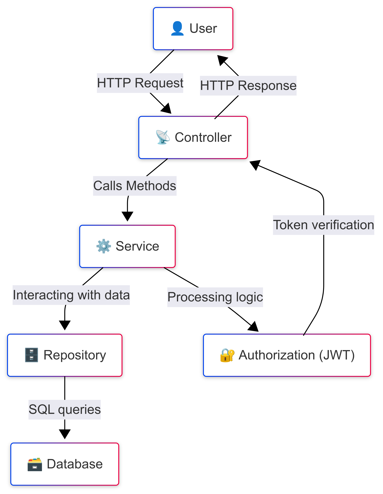

 # E-Book Market
 ___
 ## Overview
**A dynamic and user-friendly e-commerce platform designed for book lovers. This is a RESTful system that allows users to browse books, manage shopping carts, place orders, and handle authentication and authorization.**

**With robust authentication and authorization mechanisms, users can utilize personalized shopping while administrators maintain full control over inventory management.**

✅ __Book Catalog__ - Browse and search for books by title, author, or category.

🛒 __Shopping Cart__ - Add, update, or remove books before checkout.

📦 __Order Management__ - Place orders and track purchase history.

🔐 __Secure Authentication__ - Role-based access for users and administrators.

🚀 __RESTful API__ - Scalable and well-structured endpoints for smooth interaction.

**Designed with performance, security, and usability in mind, this project is an ideal foundation for building a full-fledged online bookstore.**

## Features

+ __User Roles:__ Admins can manage books, categories and orders, users can browse books, add them to carts, and place orders.
+ __Book Management:__ CRUD operations on books.
+ __Category Management:__ CRUD operations on categories.
+ __Shopping Cart:__ Users can add/remove books and update quantities.
+ __Order Management:__ Users can place orders and view order history, admins can update statuses.
+ __Authentication & Authorization:__ JWT-based authentication with role-based access control.
+ __Error Handling:__ Centralized exception handling.

## Technologies Used

+ __Backend:__ Java, Spring Boot, Spring Security, Spring Data JPA
+ __Database:__ MySQL
+ __Security:__ JWT Authentication
+ __Testing:__ JUnit, MockMvc

## API Endpoints

### Authentication

+ __Login:__ ```POST /auth/login```
+ __Register:__ ```POST /auth/register```

### Book Management 

+ __Get all books:__ ```GET /books```
+ __Find book by ID:__ ```GET /books/{id}```
+ __Create book (Admin only):__ ```POST /books```
+ __Update book (Admin only):__ ```PUT /books/{id}```
+ __Delete book (Admin only):__ ```DELETE /books/{id}```
+ __Search books:__ ```GET /books/search```

### Category Management

+ __Get all categories:__ ```GET /categories```
+ __Find category by ID:__ ```GET /categories/{id}```
+ __Create category (Admin only):__ ```POST /categories```
+ __Update category (Admin only):__ ```PUT /categories/{id}```
+ __Delete category (Admin only):__ ```DELETE /categories/{id}```
+ __Get books by category:__ ```GET /categories/{id}/books```

### Shopping Cart

+ __Get user's cart:__ ```GET /cart```
+ __Add book to cart:__ ```POST /cart```
+ __Update cart item quantity:__ ```PUT /cart/items/{cartItemId}```
+ __Remove book from cart:__ ```DELETE /cart/items/{cartItemId}```

### Order Management

+ __Place an order:__ ```POST /orders```
+ __Get order history:__ ```GET /orders```
+ __Get order items:__ ```GET /orders/{orderId}/items```
+ __Get specific order item:__ ```GET /orders/{orderId}/items/{itemId}```
+ __Update order status (Admin only):__ ```PATCH /orders/{id}```

## Security

+ __JWT Authentication__ is used for securing endpoints.
+ __User Role Permission:__
  + ```ROLE_USER```: Can browse books, manage their shopping cart, and place orders.
  + ```ROLE_ADMIN```: Can manage books, categories, and orders.

**Table of roles and accessibility**

| Action         | ROLE_USER | ROLE_ADMIN |
|----------------|-----------|------------|
| View Book      | Yes       | Yes        |
| Add Book       | No        | Yes        |
| Update Book    | No        | Yes        |
| Delete Book    | No        | Yes        |
| View Cart      | Yes       | No         |
| Place an Order | Yes       | No         |
| Manage Orders  | No        | Yes        |

### Relationships between tables (Books, Categories, Users, Orders, Cart, OrderItems)
**Relationships between tables:**
- **Users** → has **Cart** and **Orders**.
- **Orders** → consists of **OrderItems**.
- **Books** → belongs to **Categories**.
- **Cart** → contains **CartItems** that refer to **Books**.


  
## Error Handling 

+ Centralized exception handling via ```CustomGlobalExceptionHandler```.
+ __Validation errors__ return ```400 Bad Request```.
+ __Entity Not Found__ returns ```404 Not Found```.

## Testing

+ Integration tests for controllers using MockMvc.
+ Service-level unit tests.
+ Using a test container for a repository class.

## Challenges Faced

+ Implementing JWT authentication and role-based access control.
+ Handling concurrent updates in shopping cart items.
+ Optimizing search queries for books.

## E-Book Market Architecture diagram



### Link to a short video overview of the project

https://www.loom.com/share/07b7d43417654d838d5d5959a332eb8f?sid=8971e482-2576-4ca2-a7f0-c33017dfe3fe
